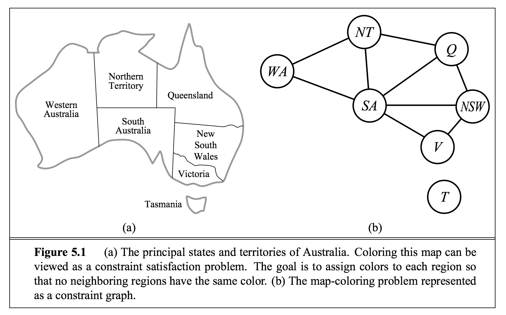

Trolling in Job Interviews

---

(a constraint satisfaction problem)

Map Coloring



[.footer: From "Artificial Intelligence: A Modern Approach"]

---

```
¯\_(ツ)_/¯
```


---

(you already know some declarative languages)

Regular Expressions

```python
import re
matches = re.findall(r"[a-zA-Z]+ \d+", "June 24, August 9, Dec 12")
```

SQL Statements

```SQL
SELECT id, full_name, grade FROM students WHERE full_name LIKE '%Irina%';
```

---

Map Coloring


[.footer: From "Seven Languages in Seven Weeks"]

---

(minikanren code)

```python
from kanren import run, fact, Relation, vars

def evenly_spaced_print(l):
    print("".join([ s.ljust(10) for s in l]))

def map_coloring():
    adjacent = Relation()
    fact(adjacent, "red", "green")
    fact(adjacent, "red", "blue")
    fact(adjacent, "green", "red")
    fact(adjacent, "green", "blue")
    fact(adjacent, "blue", "red")
    fact(adjacent, "blue", "green")

    AL, MS, GA, TN, FL = vars(5)

    solutions = run(0, (AL, MS, GA, TN, FL),
        adjacent(MS, TN),
        adjacent(MS, AL),
        adjacent(AL, TN),
        adjacent(AL, MS),
        adjacent(AL, GA),
        adjacent(AL, FL),
        adjacent(GA, FL),
        adjacent(GA, TN))

    evenly_spaced_print(["AL", "MS", "GA", "TN", "FL"])
    for s in solutions:
        evenly_spaced_print(s)


map_coloring()
```

---

(let's run it)


```bash
igossmann49-mac:logpy igossmann$ python more_examples/kanren1.py
AL        MS        GA        TN        FL
red       blue      blue      green     green
red       green     green     blue      blue
green     red       red       blue      blue
blue      red       red       green     green
blue      green     green     red       red
green     blue      blue      red       red
```

[.footer: From "Seven Languages in Seven Weeks"]
